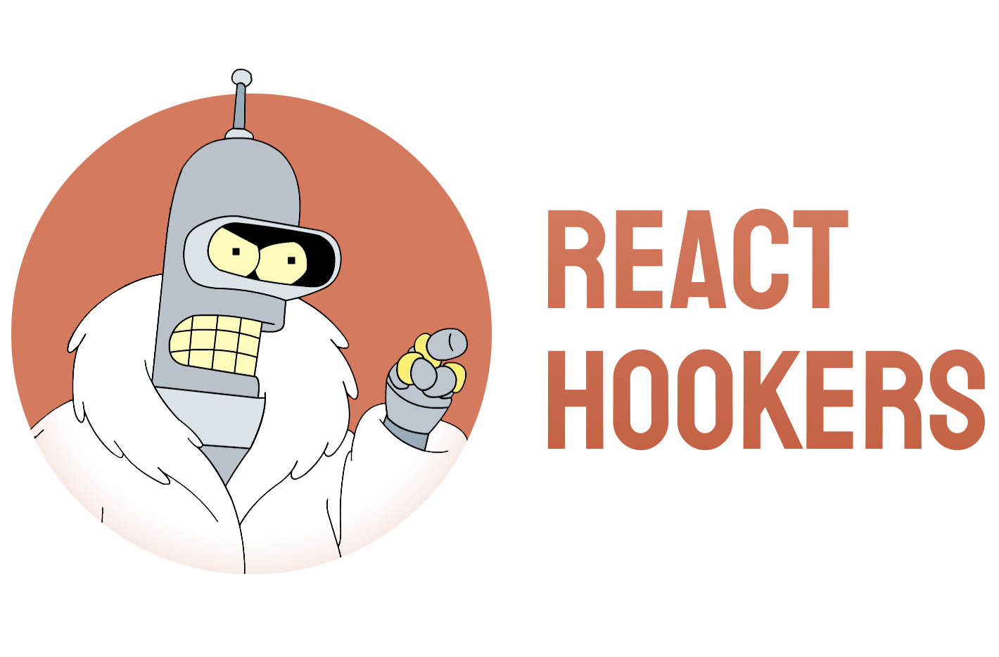

<p align="center">
    <a href="#readme">
      
    </a>
</p>

```sh
npm install --save-prod react-hookers
```

Headless UI library that provides components, behaviors, state management, and rendering primitives. 

🚀 [API documentation is available here.](https://smikhalevski.github.io/react-hookers/)
